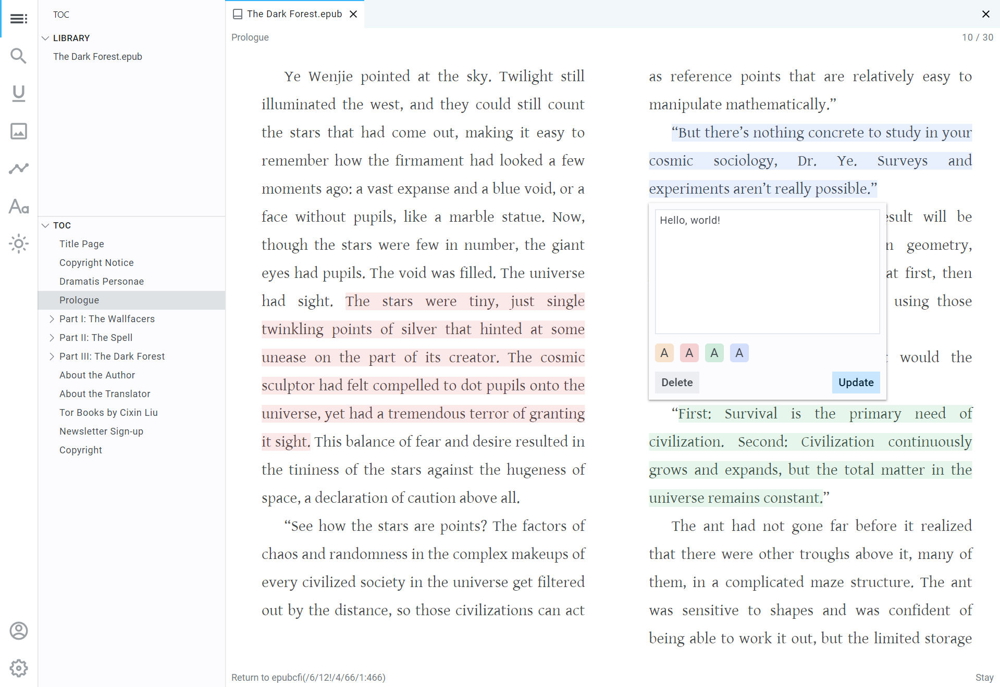

<h1 align="center"><a href="https://flowoss.com">Flow - 开源软件 (OSS)</a></h1>

<h2 align="center">重新定义 ePub 阅读器</h2>

<p align="center">免费。开源。基于浏览器。</p>

<p align="center">

</p>

## 功能特性

- **AI 大模型助手**：选中文本一键 AI 解读、侧边栏历史对话持久化与自定义 Prompt
- **WebDAV 网盘同步**：支持通过 WebDAV 跨设备同步书籍数据
- 网格布局
- 书内搜索
- 图片预览
- 自定义排版
- 高亮和标注
- 主题切换
- 通过链接分享/下载书籍
- 数据导出

计划中的功能，请查看我们的 [路线图](https://pacexy.notion.site/283696d0071c43bfb03652e8e5f47936?v=b43f4dd7a3cb4ce785d6c32b698a8ff5)。

## 开发

### 前置要求

- [Node.js](https://nodejs.org)
- [pnpm](https://pnpm.io/installation)
- [Git](https://git-scm.com/downloads)

### 克隆仓库

```bash
git clone https://github.com/cnmgch1/flow.git
```

### 安装依赖

```bash
pnpm i
```

### 设置环境变量

将所有 `.env.local.example` 文件复制并重命名为 `.env.local`，然后设置环境变量。

### 运行应用

```bash
pnpm dev
```

## 自托管

自托管之前，你应该先[设置环境变量](#setup-the-environment-variables)。

### Docker

你可以使用 docker-compose：

```sh
docker compose up -d
```

或者手动构建镜像并运行：

```sh
docker build -t flow .
docker run -p 3000:3000 --env-file apps/reader/.env.local flow
```

## 贡献

有多种方式可以参与本项目，例如：

- [提交 Bug 和功能请求](https://github.com/pacexy/flow/issues/new)，并帮助我们验证
- [提交 Pull Request](https://github.com/pacexy/flow/pulls)

## 致谢

- [Epub.js](https://github.com/futurepress/epub.js/)
- [React](https://github.com/facebook/react)
- [Next.js](https://nextjs.org/)
- [TypeScript](https://www.typescriptlang.org)
- [Vercel](https://vercel.com)
- [Turborepo](https://turbo.build/repo)
